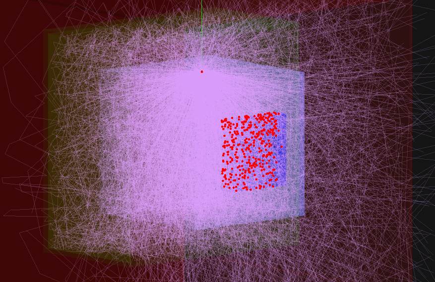

# Basic Geant4 scintillation example
Shows working scintillation and optical propagation, compatible with at least Geant4v11.02

Scintillator is CeBr3. Properties are written in header files and then
    assigned in `src/Materials.cc`.

You can configure some settings in `DetectorConstruction.cc`,
    and enable or disable scintillation in `main.cc`.

## How to run the code
1. Install Geant4 using [the getting started guide from CERN](https://geant4.web.cern.ch/support/getting_started).
2. Open a terminal and run `mkdir build && cd build && cmake .. && make`
3. Run the output executable.
4. Run a macro, for example `/control/execute macros/gps_beam_center.mac` and then `/run/beamOn 1`.
    You should get a response like in the photo below.

## File output

files output into folder of format 'run#-date-time'

output files per run:

- `scint-phots-out.tab` -> number of scintillated photons per event
- `si-out.tab` -> number of detected scintillated photons per event
- `cryst-out.tab` -> energy deposit for event (sum over each hit) or individual hit energies (configurable in Analysis.hh)
- `spec-in.tab` -> input energy spectrum
	
the files are saved by `class Analysis`.

## Things that can be configured
### configurable in DetectorConstruction.hh and DetectorConstruction.cc:
- air gap between crystal, teflon, aluminum (it's really big at the moment)
- build teflon or not
- build aluminum or not
the aluminum is red and the teflon is green just for clarity.

### configurable in Analysis.cc
- save silicon detector hit positions (saveSiPositions)
- save positions of hits inside of crystal (saveCrystPos)
- save each hit energy, not just the sum for an event (saveEachHitEnergy)

## Important notes
if you set the RINDEX for aluminum and give it a G4OpticalSkinSurface you can get weird crashes like the one in failed-aluminum.txt

you can test just optical photons using macros/optical_diagnose.mac and then beamOn.
you can test scintillation using the G4GeneralParticleSource like in macros/gps_beam_center.mac and then beamOn.
